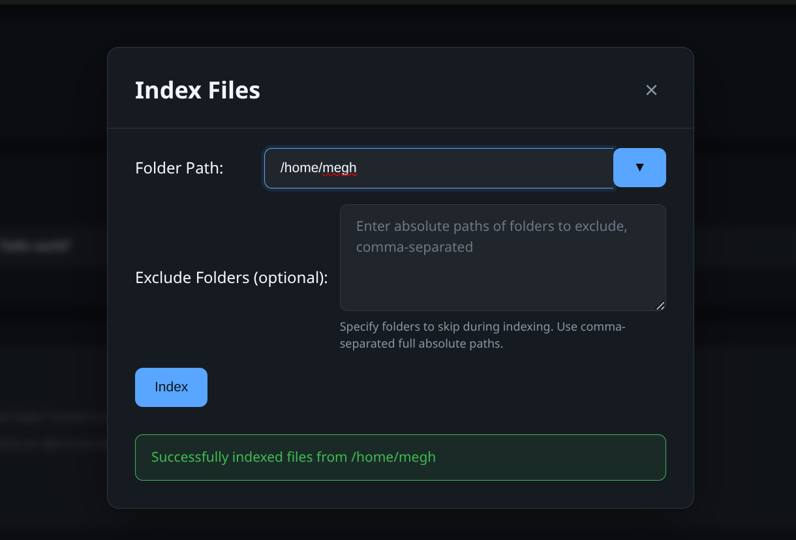
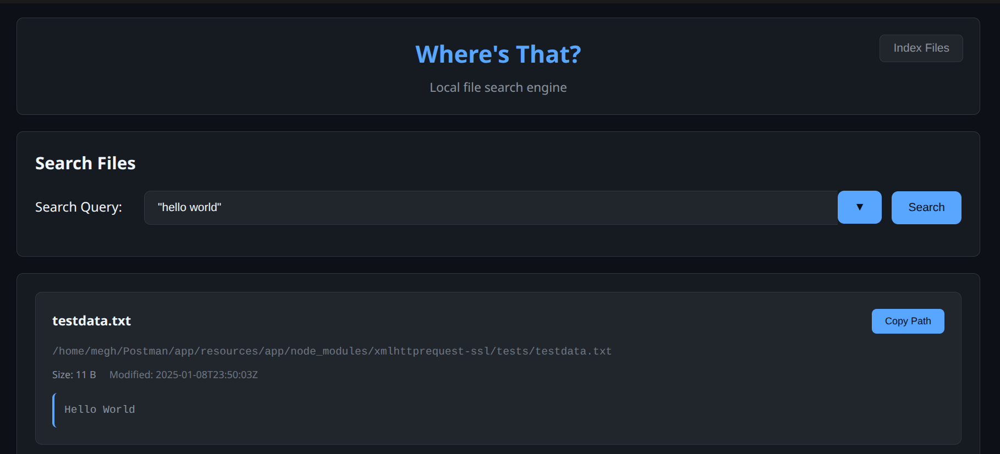

## Where's That?

This is supposed to be a simple search engine for local files.

There's a browser based UI to search for text a) within text files b) in file names and view local search results.

Note 1: It's currently been tested to work *only on Linux based systems* though it might work on other platforms.

Note 2: This is meant to be used for local search and so doesn't perform any authentication as of now.

## Install

### Using go install

```sh
go install github.com/meghashyamc/wheresthat@latest
```

Open `http://localhost:8080/ui` in a browser to access `Wheres's That`.

## Index Files

Before you can search for files, you need to create an index. Click on the `Index` button, enter the root path to index and wait for the indexing to finish. Indexing may take a long time the first time. Subsequent indexing should only index changed files and should happen quickly.




## Search for Files

The UI allows easy searching for terms in all file names and in the content of files containing text. Quoted searches are supported. So, `"hello world"` will search for the whole phrase "hello world". On the other hand, `hello world` will search for documents that contain both `hello` and `world` anywhere in the text.



## Configuration

The default configuration is in `config/config.local.yaml` and can be changed as needed if the repo is cloned locally.